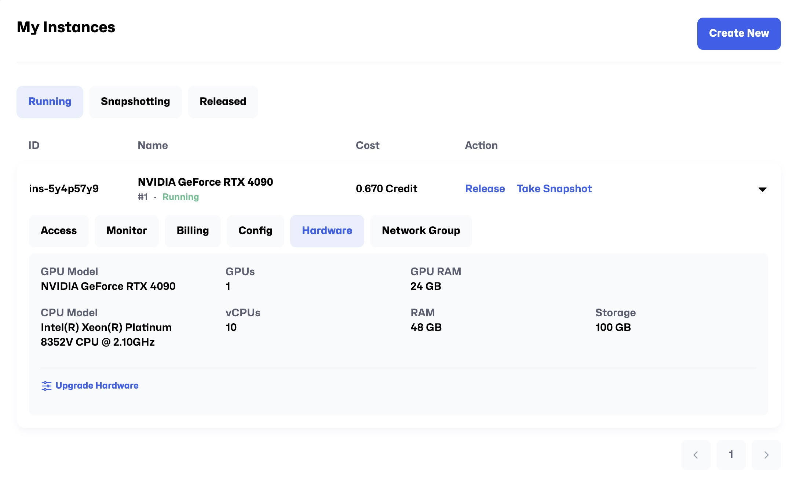

# Instance Management

On the **My Instance** page, you can view and manage the status and configuration of all instances. Below is a detailed introduction to the features:

---

## **Instance Status**

On the **My Instance** page, you can see three instance statuses:

1. **Running**: The instance is running, and you can access or manage it.
2. **Snapshotting**: The instance is performing a snapshot operation, temporarily unavailable for other management operations.
3. **Released**: The instance has been released, and resources have been reclaimed. Instances in this state cannot be restarted.

**Each status has a list of instances with the following fields**:

- **ID**: The unique identifier of each instance.
- **Name**: The name of the instance, which helps users identify it.
- **Cost**: The billing status and accumulated cost of the current instance.
- **Action**: The operations that can be performed on the instance (see the operations section below).

## 

## **Tabs**

Click on a row in the instance list to view and manage the corresponding instance through the following tabs:

### **1. Access**

- **SSH Port 22**

  - View information related to SSH connections:
    - **SSH Command**: `ssh -p <Service Port> root@<Access URL>`
    - **Service Port**: The service port of the instance.
    - **User**: The default username is `root`.
    - **Password**: The initial password (displayed encrypted).

- **HTTP Port 8888**

  - Provides the following actions:
    - **Link**: Quickly jump to the HTTP address.
    - **Open**: Open the link in a new tab.
    - **Copy**: Copy the HTTP address.
    - **Edit**: Edit the port settings (if available).
    - **Delete**: Delete the configuration for this port.

- **New Port Forwarding**: Click this button to add a port forwarding rule, filling in the following information:

  - **Service Port**: Set the service port.
  - **Protocol**: Choose the protocol type (currently supports only HTTPS).

## 

### **2. Monitor**

View the real-time performance and resource usage of the instance.

## 

### **3. Billing**

Display all billing details related to the instance.

## 

### **4. Config**

View the instance configuration, such as image-related parameter settings.

## 

### **5. Hardware**

Check the hardware configuration of the instance, including GPU or CPU models, memory, storage, etc.

## 

### **6. Network Group**

View the network group of the instance.

## 

---

## **Actions Available When the Instance is Running**

In the action column, there are two buttons: `Take Snapshot` and `Release`.

### **1. Take Snapshot**

- **Function**: Take a snapshot of the current instance's basic configuration and storage.
- **Use Cases**:
  - Save important configurations or states for future use.
  - Provide a reference base for creating subsequent instances.

#### **Take Snapshot Detailed Steps**

1. **Click the `Take Snapshot` button in the Action column to open the snapshot creation window.**

## 

2. **Fill in the snapshot information**:

   - **Name**: Enter the snapshot name.
   - **Automatic release of machine after successful saving**: If selected, the instance will be automatically released after the snapshot is saved.

3. **View the snapshot process**:

   - During the saving process, the instance will appear under the **Snapshotting** tab, showing status changes:

     - **Suspending** → **Paused** → Disappears from the list.

     ## 

     ## 

   - After saving, the instance will no longer appear on the **My Instance** page and will be stored as a snapshot, viewable on the **Snapshots** page.

4. **Post-Snapshot Effects**:

   - During the snapshot process, the instance will be paused and will either resume or be released after saving, depending on whether automatic release is selected.

#### **Notes**

- The instance will be temporarily unavailable during the saving process and will automatically reconnect afterward.
- Ensure sufficient personal storage space before saving a snapshot.

---

### **2. Release**

- **Function**: Release the instance resources, changing the instance status to **Released**.
- **Use Cases**: When you no longer need the instance, you can choose to release it to reclaim resources and stop billing.

#### **Release Detailed Steps**

1. **Click the `Release` button in the Action column** to open the confirmation window.

## 

2. **Confirm the release**:

   - The system will prompt related notices, such as data deletion and irreversibility.
   - Click `Stop & Release` to confirm the release operation.

3. **Status Updates During Release Process**:

   - The instance status will change to **Releasing** and eventually update to **Released**.

4. **Post-Release Effects**:

   - **Instances in Released status will appear under the Released tab.**
   - Released instances cannot be restarted, and all unsaved data will be deleted.

   ## 

#### **Notes**

- **Irreversible**: The release operation cannot be undone, so ensure the instance is no longer needed.
- **Billing**: Resource usage costs for the instance will stop after release.
- **Snapshot Recommendation**: If you need to retain data, take a **snapshot** before releasing the instance.

---

## **Summary of Notes**

1. **Snapshotting and Released Restrictions**:

   - Only the **Config** and **Hardware** tabs are viewable in these two states; other operations are not allowed.

2. **Release and Snapshot Recommendations**:

   - Before choosing the release operation, ensure you need to retain the current data.
   - Regular snapshots can help save critical data.

3. **Operational Impact**:

   - Some operations (like snapshot and release) may interrupt the normal use of the instance, so schedule them appropriately.

This is the complete guide to instance management. For more detailed instructions, please refer to subsequent sections.
