# 如何使用 PyCharm 遠端連線至 Glows.ai

如果你在編寫程式時使用 PyCharm 等 IDE 工具，可以透過 SSH 功能遠端使用 [Glows.ai](https://glows.ai) 提供的開發環境，這樣可以更方便地運用 GPU 服務。

本教學將說明如何透過 PyCharm 使用 Glows.ai。

---

## **使用前的重要說明**

- **請確保你的 PyCharm 版本為專業版（Professional Edition）**，因為只有專業版才支援 SSH 遠端連線。社群版（Community Edition）不支援此功能。

- **PyCharm 適用於程式碼除錯（Debug）**，如果需要長時間訓練模型，請使用 SSH 並搭配 `tmux` 或 `nohup` 指令，否則因網路問題或意外關閉 PyCharm 可能導致訓練中斷。

- **PyCharm 不適合傳輸大型資料集**，建議僅同步除錯所需的腳本，避免同步完整的資料集。

- **PyCharm 是 JetBrains 開發的工具**，Glows.ai 僅提供連線教學，若有 IDE 相關問題，請聯繫 PyCharm 官方支援。

- 本教學使用的 PyCharm 版本為 **PyCharm 2024.2.4（專業版）**。
  

---

首先，你需要在 [Glows.ai 租借 GPU](https://platform.glows.ai/create)。

接著，設定 PyCharm 環境以使用 Glows.ai 的 GPU。

---

## **步驟 1：建立新的 PyCharm 專案**

如果你已經有本地專案，請先透過 [Data Drive](https://platform.glows.ai/data) 上傳資料集，並且只保留除錯所需的腳本。

1. 開啟 PyCharm，建立新的 Python 專案。
2. 點擊 `Create to start` 建立新專案。

   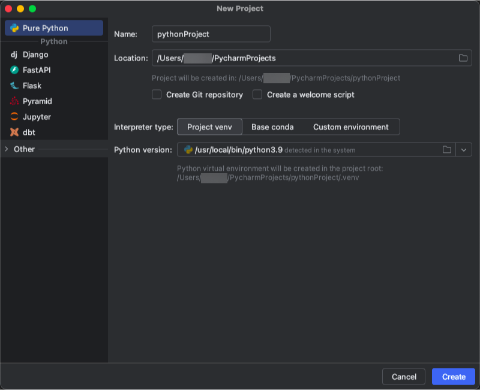

3. 右鍵專案資料夾，新增 Python 檔案。

   

4. 命名 Python 檔案，例如 "Test"。

   

5. 在檔案內寫入一個簡單的指令：

   ```python
   print("Hello world!")
   ```

   

---

## **步驟 2：設定遠端連線**

1. **設定 Python 直譯器**

- **Windows 用戶**：點擊 **File -> Settings**。

  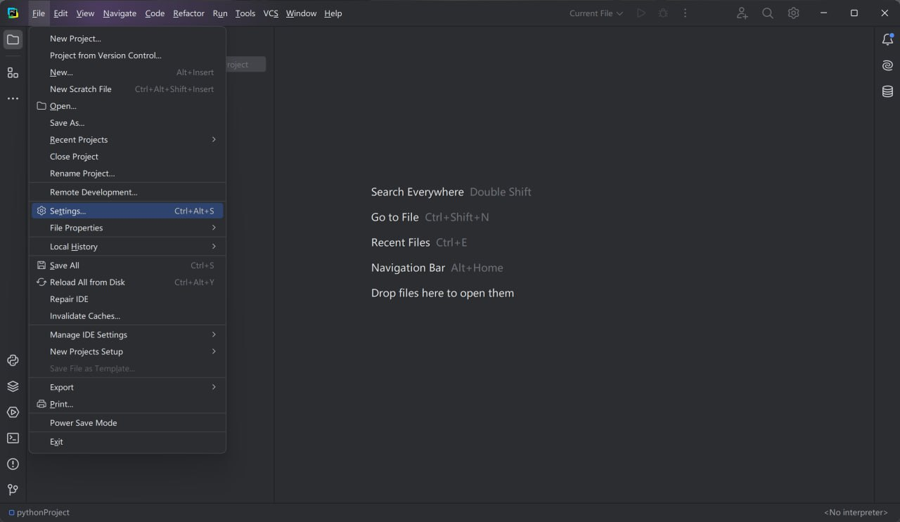

- **Mac 用戶**：點擊 **PyCharm -> Preferences**。

  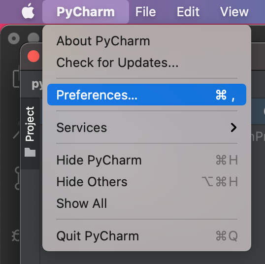

**PyCharm 2024 版本**

2. 點擊 **Project:pythonProject -> Python Interpreter**，然後點擊 `Add Interpreter` -> `On SSH`，新增遠端直譯器。

   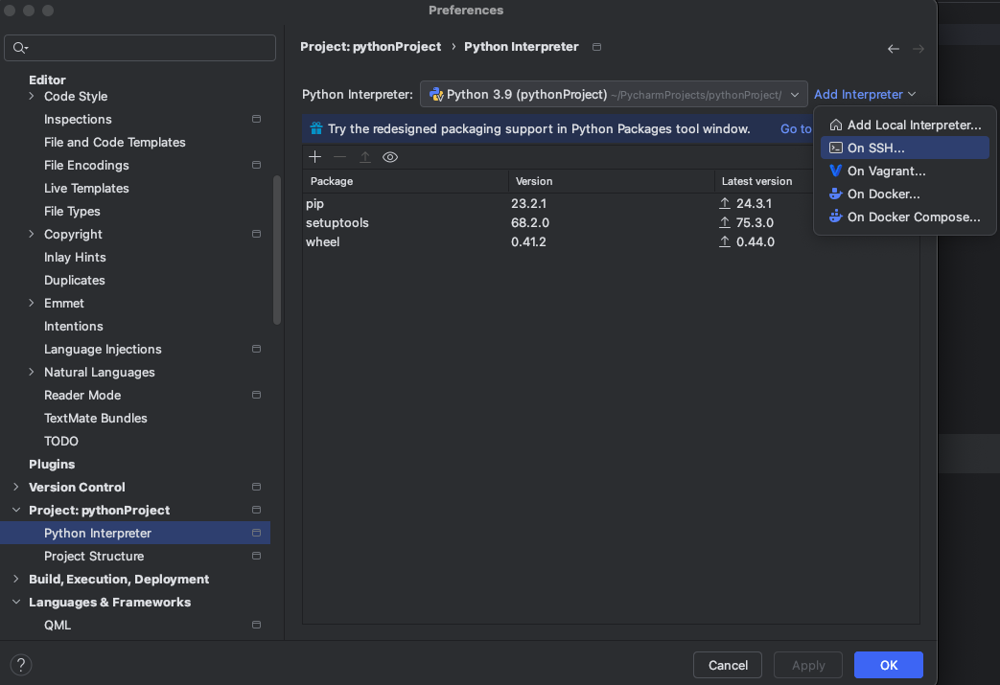

3. 輸入租借機器的資訊：

   - **Host**：使用 SSH 提供的網域名稱。
   - **Port**：SSH 連線資訊中 `-p` 之後的數字，例如 `23470`（通常為五位數）。
   - **Username**：`root`。

   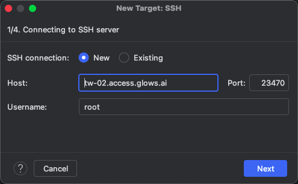

   

4. 點擊 `Next`，在直譯器選擇頁面，選擇 `System Interpreter`，並輸入租借機器的 Python 直譯器路徑：

   ```
   /root/miniconda3/envs/workenv/bin/python
   ```

   - 如果你建立了自己的 Conda 環境，請改成對應的環境路徑。
   - **建議將專案目錄修改為 `/datadrive` 來避免同步問題**。

5. 點擊 `Create` 完成遠端直譯器的新增。

   

6. 點擊 `Apply` 開始同步。

   

---

## **步驟 3：執行程式碼**

同步完成後，右鍵 Python 檔案，點擊 `Run` 執行。

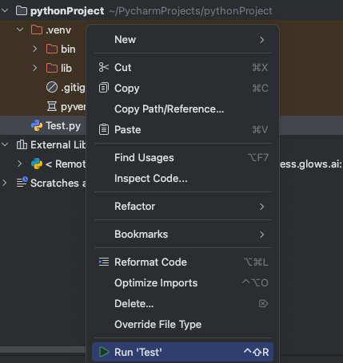

成功執行後，你可以看到輸出結果。

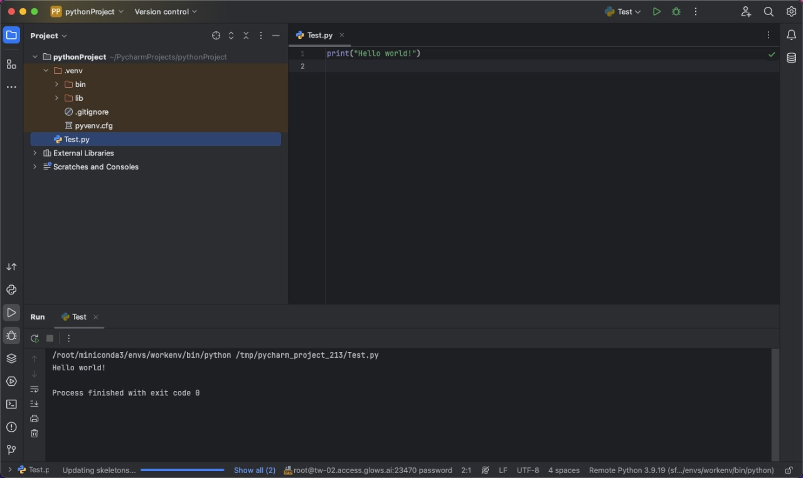

---

## **步驟 4：安裝 Python 套件**

當 PyCharm 連線至伺服器後，如果執行時遇到缺少套件的問題，可參考以下方式安裝：

1. **確認 Python 直譯器是否正確**

   - 預設系統環境的 Python 路徑為：
     ```
     /root/miniconda3/envs/workenv/bin/python
     ```
   - 如果你有建立新的環境，請選擇對應的直譯器。

2. **透過 PyCharm SSH Session 安裝套件**
   - 點擊 **Tools -> Start SSH Session**。
   - 在終端機輸入：
     ```bash
     pip install package_name
     ```
   - 若 PyCharm 仍顯示紅色底線但程式能正常執行，可忽略此警告。

---

## **步驟 5：設定檔案同步**

通常，設定 Python 直譯器後，檔案同步會自動啟動。如果未自動同步，可手動設定：

1. 點擊 **Tools -> Deployment -> Configuration**。

   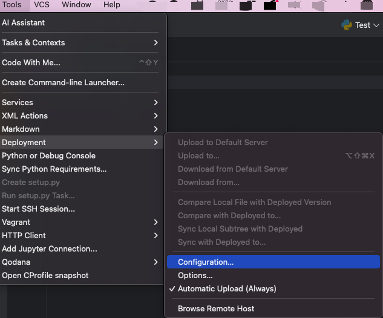

2. 修改 **Host** 和 **Port**，確保與租借機器的資訊一致。

   
   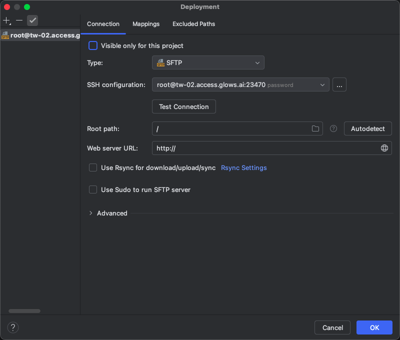

3. **更改名稱以便識別**

   - 右鍵連線名稱，選擇 `Rename`，改為 `Glows.ai`。

   

---

## **步驟 6：上傳/下載檔案**

- **PyCharm 會自動同步本地專案的檔案至遠端伺服器**，你可以在 `File Transfer` 頁面查看同步狀態。

  

- 如果未自動同步，可手動上傳或下載：

  - 選取需要同步的檔案，右鍵，選擇 **Deployment -> Upload to xxx**。
  - 若遠端檔案有變更，可選擇 **Deployment -> Download from xxx** 下載至本地。

  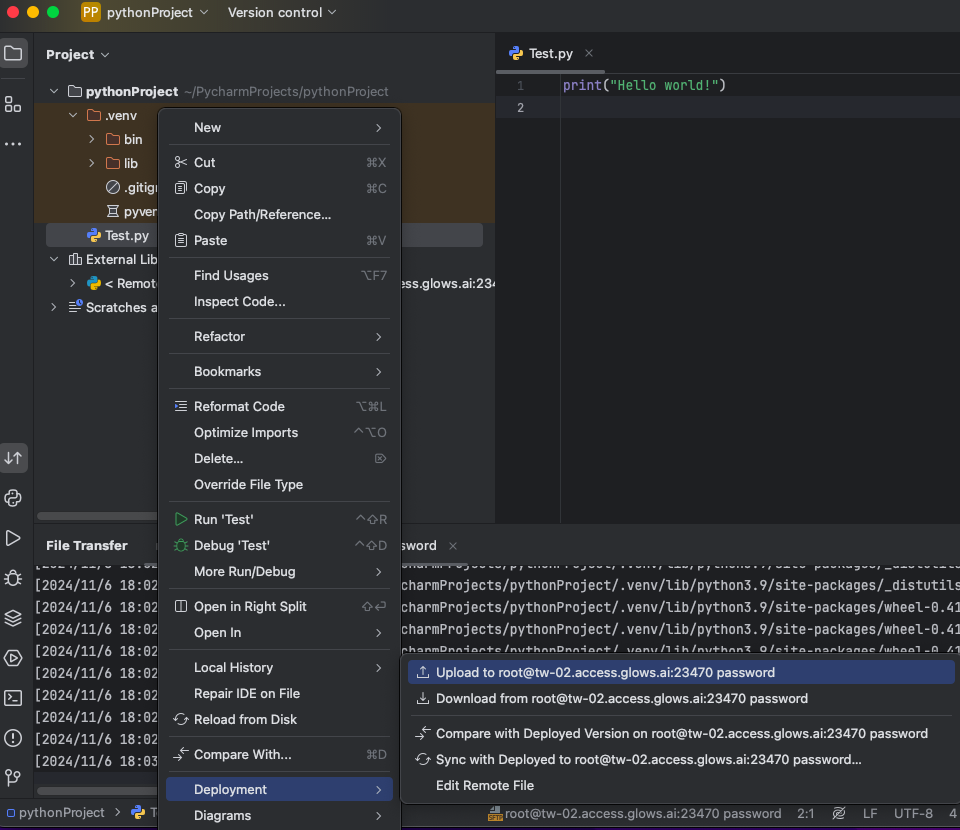

---

## **使用遠端終端機**

如果想透過 PyCharm 執行遠端命令，可使用 `Terminal` 工具：

1. 點擊 **Tools -> Start SSH Session** 連線至遠端伺服器。

   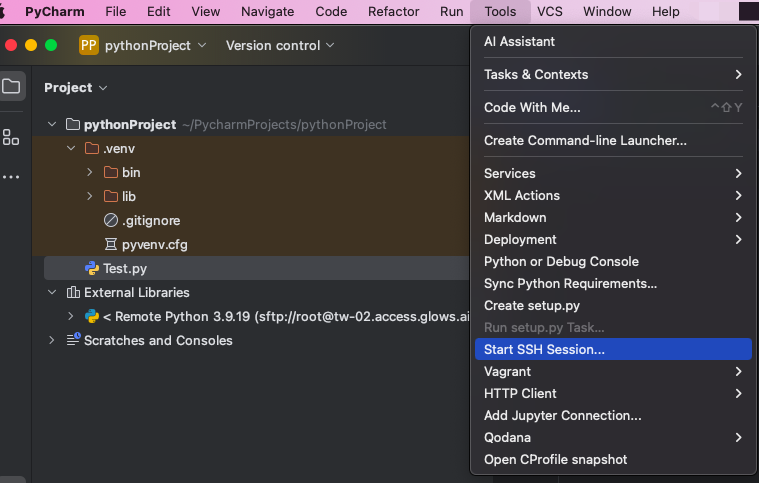

2. 選擇 `Glows.ai` 進行連線。

   

3. 連線後，PyCharm 會開啟新的 `Terminal`，你可以在此執行 Bash 指令。

   

---

這樣你就成功在 PyCharm 設定遠端連線至 Glows.ai 了！🚀
