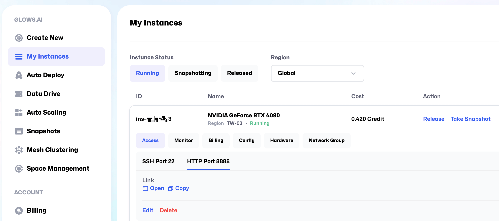
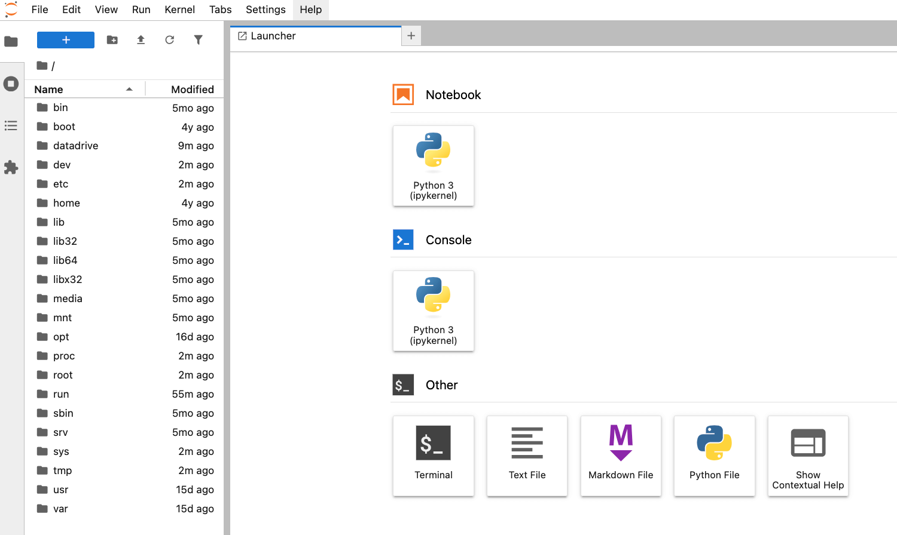
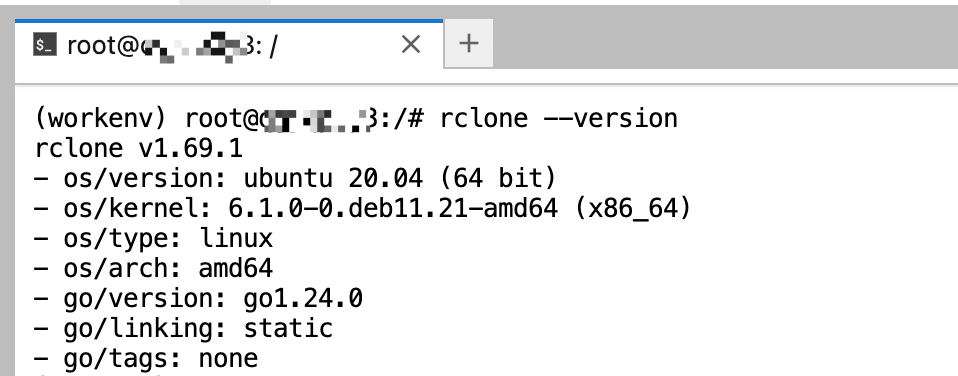
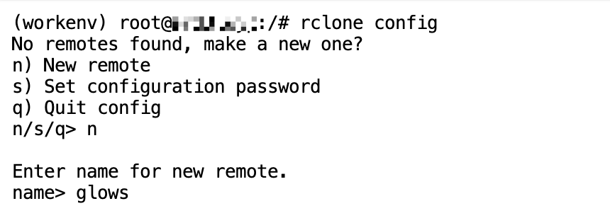
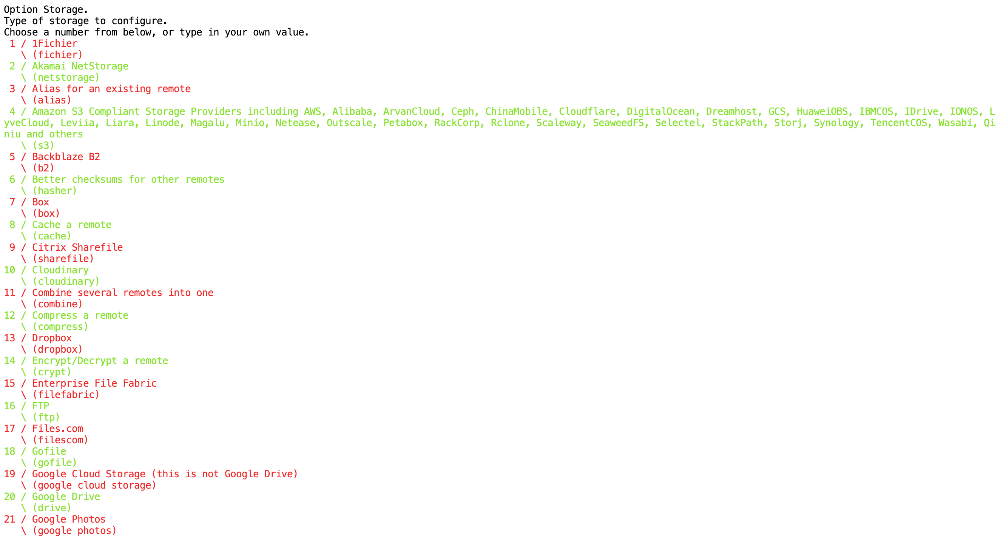
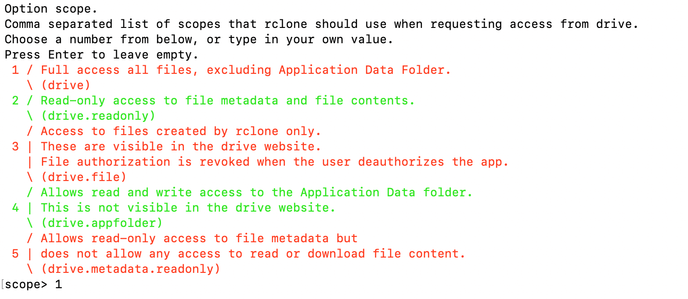
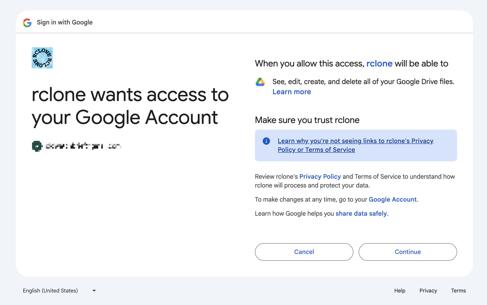
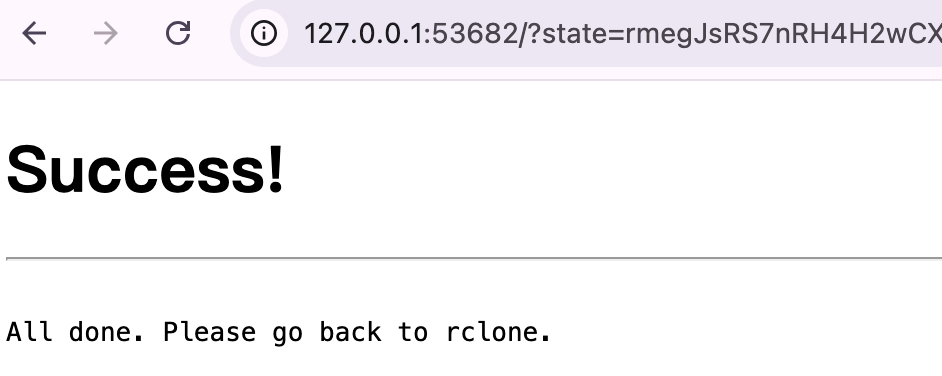
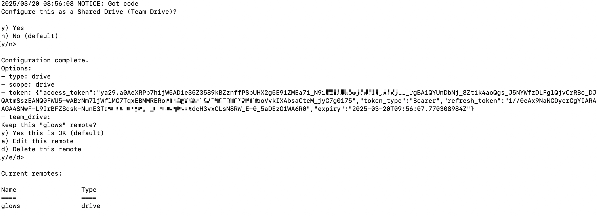
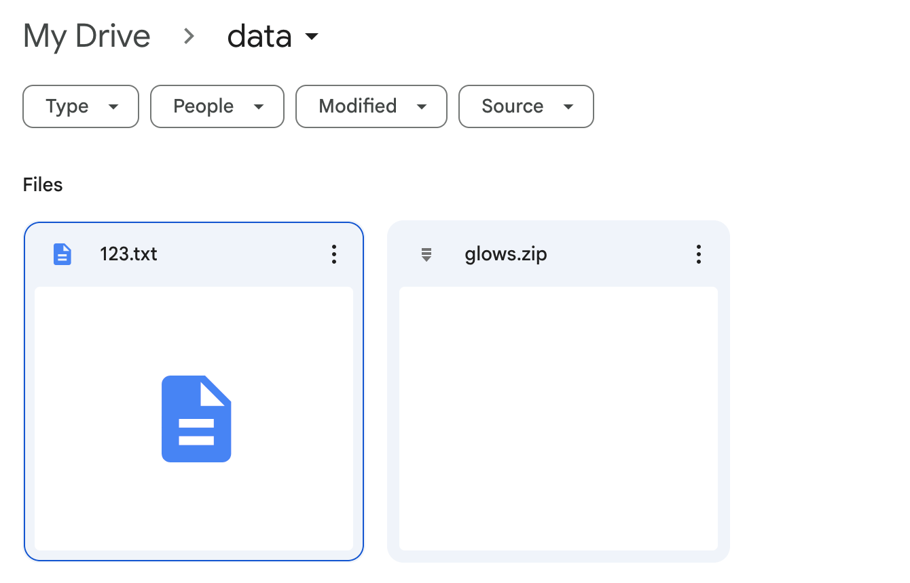

# 如何在 Glows.ai 下載與上傳雲端硬碟資料

本教學將指引您如何在 Glows.ai 的實例上操作 Google Drive 等雲端硬碟資料的下載與上傳。請確保您選擇的映像檔中**包含 SSH 或 JupyterLab 功能**。

---

## **步驟 1：建立實例**

請先根據您的需求，在 Glows.ai 上建立一個新實例。若不清楚操作流程，可參考[創建新實例教學](https://docs.glows.ai/docs/Create%20New)。

---

## **步驟 2：安裝 Rclone 工具**

> **Rclone** 是一款功能強大的命令列工具，可用於與多種雲端儲存服務，進行資料同步、加密、壓縮及多執行緒傳輸，能大幅提升管理雲端與本地資料的效率。

當您的實例狀態為 `Running` 時，點擊 `Access` 區塊內的 `8888` 端口，並點選 `Open` 按鈕，即可開啟該實例的 JupyterLab 介面。



進入 **JupyterLab** 後，點選 Launcher 中的 Terminal 啟動終端機。



在終端機中輸入以下指令以安裝 Rclone：

```bash
curl https://rclone.org/install.sh | bash
```

安裝完成後，可使用以下指令確認版本是否正確安裝：

```bash
rclone --version
```



---

## **步驟 3：設定 Google Drive**

在終端機中輸入以下指令開始設定：

```bash
rclone config
```

依照指示操作：

1. 輸入 `n` 以建立新的 remote（遠端儲存設定），remote 是 Rclone 用來代表雲端儲存服務的名稱設定，您可以依需求自訂一個辨識用名稱。

2. 接著為該 remote 命名，例如 `glows` 或 `mydrive`，方便後續使用指令時引用。



接著選擇您要連接的雲端硬碟服務。本教學以 Google Drive 為例，可輸入 `drive` 或對應的序號（如 `20`）。




- `client_id` 與 `client_secret` 請直接按 `Enter` 採用預設值。
- 權限選項請輸入 `1` 以取得完整權限。



後續選項皆可直接按 `Enter` 採用預設值。

---

### 注意：選擇認證方式

此時會出現兩種 Google Drive 認證方式：

- **方式一：** 使用瀏覽器直接認證（僅適用於本機操作）
- **方式二：** 在本地安裝 Rclone，進行端口轉發認證 ✅ **建議使用**

由於認證服務是在 Glows.ai 的伺服器上，若直接在本地瀏覽器開啟畫面中提供的連結，將無法順利載入頁面。

因此，我們建議使用第二種方式：請先在**本地電腦的終端機（CMD/Terminal）**輸入以下指令進行 SSH 端口轉發：

```bash
ssh -p 23482 -NL 53682:localhost:53682 root@tw-02.access.glows.ai
```

**格式說明：**  
`ssh -p [SSH 服務端口] -NL 53682:localhost:53682 root@[SSH 主機]`


輸入 SSH 密碼後按 `Enter`，若未出現錯誤訊息，即表示端口轉發成功。接著請於**本地瀏覽器**中開啟指令中出現的 Google 認證連結，登入您的 Google 帳號完成授權。



完成後，頁面會顯示 `Success!`，即代表認證成功。



回到伺服器上的 Rclone 設定畫面，當被詢問是否要設定為 Team Drive 時，直接按 `Enter` 略過。此時您將看到 `Configuration complete` 訊息與相關設定資料。



---

## **步驟 4：資料上傳與下載操作**

### 從 Google Drive 下載資料至實例

```bash
# 格式：
rclone copy [Remote Name]:[Google Drive 資料路徑] [本地路徑] --progress

# 範例：
rclone copy glows:/data/glows.zip ./ --progress
```

上述指令會將 Google Drive 上的 `/data/glows.zip` 檔案下載至本地當前目錄，`--progress` 參數則會顯示下載進度。


---

### 將資料從實例上傳至 Google Drive

```bash
# 格式：
rclone copy [本地檔案路徑] [Remote Name]:[Google Drive 目的路徑] --progress

# 範例：
rclone copy 123.txt glows:/data --progress
```

此指令會將本地的 `123.txt` 上傳至 Google Drive 的 `/data` 資料夾。




---

## 聯繫我們

若您在使用 Glows.ai 過程中有任何問題或建議，歡迎透過以下方式聯繫我們：

**Email：support@glows.ai**
